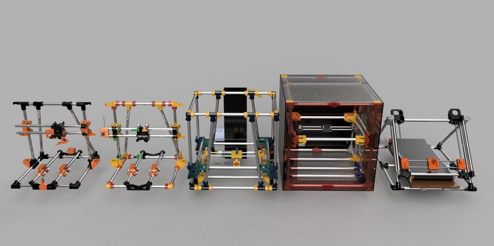

# ReadMe

Welcome to the Piper-2 Organization Project!

## Description

Piper-3d is an exciting project that aims to revolutionize the world of low cost 3D engineering. It is a powerful tool that assists makers in high-quality 3D printer building using affordable and readily available parts. The Piper 3d printers are opensource and welcome contributions with a Creative Commons Share Alike license.

## Features

- US and European Electrical Conduit
- Different Build Platforms
- A variety of Design Features
- The latest advances in 3D printing technology

## Getting Started

To get started with Piper3D, follow these steps:

1. Clone the repository.
2. Open the Parts List table for your desired build.
3. Print and Checkoff parts as you aquire them.
4. Build your printer
5. Create new modifications and share them with others!

## Contribution

[Piper3printers](https://piper3dprinters.com/) started in 2016 by Alex Balako.

Designs are found on [Thingiverse/piper3d](https://www.thingiverse.com/piper3d/designs)

**I updated this repo to contain all the Piper3d related items I could find, so I could learn more and figure out what I need to print. This is not meant to be an official resource.*

## License

Piper-2 is licensed under the [Creative Commons - Attribution - Non-Commercial - Share Alikee](./LICENSE).
